# Knowledge-base pipeline diagram

Diagrams `pipeline.build_knowledge_base(cfg)` (`src/doc_agent/pipeline.py`) exactly as
written — stage order and function calls below are copied from that file, not redrawn
from memory, so this stays true to the code rather than to the plan. It does **not**
cover Stage 5 (retrieval) or Stage 6 (agent) — those are wired by `pipeline.answer()`,
a separate entry point, and are A3 scope (`retrieval/retriever.py` is still an
unimplemented stub on purpose).

## Stage graph

```mermaid
flowchart TD
    A["data/pages/*.png\n(rendered at 300 dpi, Step 3)"] --> B

    subgraph S0["Stage 0 — Ingest"]
        B["loader.load_pages(cfg)\ningest/loader.py"]
        C["preprocess.run(pages, cfg)\ningest/preprocess.py\ndeskew · denoise · CLAHE\n(grayscale kept, no binarisation)"]
        B -->|"list[Page]"| C
    end

    C -->|"list[Page]"| D

    subgraph S1["Stage 1 — Enhancement (DISABLED)"]
        D["enhance.run(pages, cfg)\ningest/enhance.py"]
    end

    D -->|"list[Page]\n(pass-through — see note below)"| HOOK1

    HOOK1{{"hooks.run(AFTER_INGEST)\nno handler registered\n(extension point, unused)"}}
    HOOK1 -->|"list[Page]"| E

    subgraph S2["Stage 2 — Layout"]
        E["layout.detect(pages, cfg)\nvision/layout.py\nmicrosoft/table-transformer-detection\nprojection-profile + TATR, score_thr 0.5\ntwo-column split → blocks → table flag\nreading order: left column then right"]
    end

    E -->|"list[Region]\n(page_id, bbox, kind)"| F

    subgraph S3["Stage 3 — OCR"]
        F["ocr.transcribe(regions, cfg)\nvision/ocr.py\nfacebook/nougat-base + LoRA adapter\n(finetune: true, adapter_dir=curve_n122)\nregion-routed table adapter\n(table_adapter_dir=table_ft, Step 28/30)"]
    end

    F -->|"list[Chunk]\n(pre-split, one per region;\nocr_confidence + bbox to\ndata/ocr/meta.jsonl sidecar)"| HOOK2

    HOOK2{{"hooks.run(AFTER_OCR)\ngovernance/pii.py::_scrub\nredacts PII in chunk text"}}
    HOOK2 -->|"list[Chunk]"| G

    subgraph S4a["Stage 4 — Chunk"]
        G["chunk.split(text, cfg)\nindex/chunk.py\nsemantic: one chunk per numbered\nformula block + its condition of\nvalidity; prose split at headers;\nchunk_tokens=512 ceiling; overlap=0"]
    end

    G -->|"list[Chunk]\n(final chunk ids, e.g.\nch06_gamma|as_p0255|r03|6.1.8)"| HOOK3

    HOOK3{{"hooks.run(BEFORE_INDEX)\nno handler registered\n(extension point, unused)"}}
    HOOK3 -->|"list[Chunk]"| H

    subgraph S4b["Stage 4 — Embed + Store"]
        H["embed.encode(chunks, cfg)\nindex/embed.py\nBAAI/bge-m3, dim 1024\nbatched, seeded, L2-normalised\ncached to embed_cache.npz"]
        I["store.build(chunks, vectors, cfg)\nindex/store.py\nfaiss:flat (IndexFlatIP = exact cosine)"]
        H -->|"np.ndarray\n(n_chunks, 1024)"| I
    end

    I --> J["data/index/\nfaiss.index · chunks.jsonl · index_meta.json\n(gitignored — rebuilt by scripts/build_index.sh,\nnever shipped; plan.md Sec.11.6)"]
```

## What each arrow actually carries

| Arrow | Contract (`src/doc_agent/contracts.py`) | Notes |
|---|---|---|
| pages → loader | — | `data/pages/as_pNNNN.png`, 300-dpi grayscale renders (Step 3) |
| loader → preprocess | `list[Page]` | `Page.id`, `Page.image_path`, `Page.doc_id` (chapter, e.g. `ch06_gamma`) |
| preprocess → enhance | `list[Page]` | same shape; pixels touched only (deskew/denoise/CLAHE), fields unchanged |
| enhance → hooks(AFTER_INGEST) | `list[Page]` | **pass-through, unchanged** — see disabled-stage note below |
| hooks(AFTER_INGEST) → layout | `list[Page]` | no handler is registered at this seam yet (`wiring.py`), so `ctx` returns as given |
| layout → OCR | `list[Region]` | `Region.page_id`, `Region.bbox`, `Region.kind ∈ {text, table, figure, heading}`, in reading order |
| OCR → hooks(AFTER_OCR) | `list[Chunk]` | `Chunk.id` carries the formula-id regex match if one was found in the region; `ocr_confidence`/`bbox` go to the `data/ocr/meta.jsonl` sidecar, not the contract itself |
| hooks(AFTER_OCR) → chunk | `list[Chunk]` | **`governance/pii.py`'s `_scrub` runs here** (`wiring.register_all`) — redacts any detected PII spans before chunking; corpus is near-PII-free (front-matter names only) so this is mostly a no-op in practice, but it always runs |
| chunk → hooks(BEFORE_INDEX) | `list[Chunk]` | one chunk per formula block (+ its condition of validity) or per header-bounded prose run; `Chunk.id`/`doc_id` carried through from the OCR stage, formula id recomputed per actual formula found |
| hooks(BEFORE_INDEX) → embed | `list[Chunk]` | no handler is registered at this seam yet either — same extension-point status as `AFTER_INGEST` |
| embed → store | `np.ndarray` | shape `(n_chunks, cfg["embed"]["dim"])` = `(n_chunks, 1024)`, aligned 1:1 with the chunk list, unit-normalised for cosine |
| store → disk | 3 files | `faiss.index` (IndexFlatIP), `chunks.jsonl` (sidecar to rebuild `Chunk` objects on load), `index_meta.json` (n_chunks, dim, index type, size, pages/chapters covered) — see `kb_demo.ipynb`'s Step 31 cell for the real numbers |

## The disabled stage — Stage 1, Enhancement

`configs/config.yaml` locks `enhance: {enabled: false, model: "none", type: "none"}`.
`ingest/enhance.py::run()` checks that flag first and returns `pages` completely
untouched when it's off — the `Enhancer` class (a VAE/diffusion generative denoiser)
never gets constructed, so `train()`/`apply()`'s `NotImplementedError` stubs never fire.

**Why off, not just unimplemented:** this is a deliberate A1 trade-off (see the inline
comment on that config line), not a stub we forgot. A&S is a clean 1964 print scan —
uniform lighting, no water damage or bleed-through — so classical `preprocess.py`
(deskew, median/bilateral denoise, CLAHE) already gets the pixels into good shape.
A generative enhancer's main value is *hallucinating plausible detail into badly
degraded scans*; on formula-dense math notation, an OCR-facing model inventing
plausible-looking strokes it wasn't sure about is a correctness risk we don't need to
take for a corpus that doesn't have the degradation problem this stage exists to solve.
Turning it on is a one-line config flip (`enhance.enabled: true`) if a future corpus
needs it — the pipeline stage stays in the fixed order either way (`pipeline.py`'s
docstring: *"Do not reorder stages or remove hooks.run()/register_all() calls"*), it
just becomes a pass-through instead of a no-op-because-unbuilt.

## Extension seams shown but not (yet) used

`hooks.run(AFTER_INGEST)` and `hooks.run(BEFORE_INDEX)` are both called unconditionally
by `build_knowledge_base()`, but `wiring.register_all()` (the single manifest of what's
wired where) registers nothing at either one today — only `AFTER_OCR`, `BEFORE_ANSWER`,
`ON_LOG` (PII), `ON_STEP`/`ON_TOOL_CALL`/`AFTER_ANSWER` (tracing), and `ON_TOOL_CALL`
(guardrails) have handlers. They're drawn here because they're real, fixed points in
the stage order (`hooks.py`: *"Do NOT add/remove seams or the `hooks.run()` calls that
use them"*) — a future horizontal feature (e.g. a corpus-level dedup pass, or a
before-indexing quality filter) attaches here without touching `pipeline.py` again.
